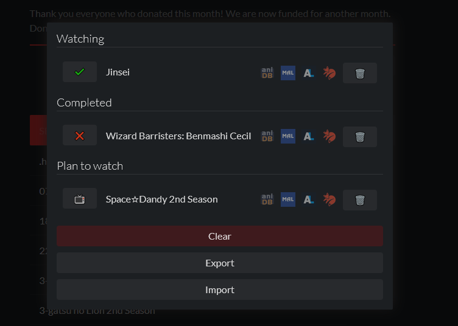

# anime-twist-premium-extension [](https://gitpod.io/#https://github.com/thoughtsunificator/anime-twist-premium-extension)

Browser Extension for anime-twist-premium



Available on:

- [Firefox](https://addons.mozilla.org/en-US/firefox/addon/anime-twist-premium/)
- [Chrome](https://chrome.google.com/webstore/detail/anime-twist-premium/nkojcnopablpombnbfadmhbhdlepgcdo)

## Getting started

### Installing

Clone the repository along with its submodules:

```git clone --recurse-submodules https://github.com/thoughtsunificator/anime-twist-premium-extension.git```

### Run

- npm install
- npm start

### Build

- npm install
- npm run build